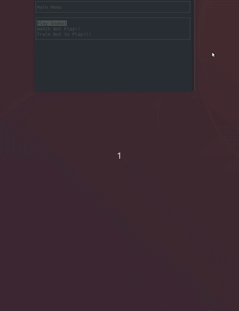

# RL Snake Game

This is a Reinforcement Learning Snake Game with an NCurses UI for selecting to either:
1. Play snake yourself.
1. Watch an RL bot play.
1. Train a new RL bot to play, which you can then watch.

### Example

<p align="center">

</p>

The game code for this repo was inspired
by [CppND-Capstone-Snake-Game](https://github.com/udacity/CppND-Capstone-Snake-Game).

## Dependencies for Running Locally

* cmake >= 3.13
* All OSes: [click here for installation instructions](https://cmake.org/install/)
* make >= 4.1 (Linux, Mac)
    * Linux: make is installed by default on most Linux distros
    * Mac: [install Xcode command line tools to get make](https://developer.apple.com/xcode/features/)
* SDL2 >= 2.0
    * All installation instructions can be found [here](https://wiki.libsdl.org/Installation)
    * Note that for Linux, an `apt` or `apt-get` installation is preferred to building from source.
* NCurses >= 6.1
* gcc/g++ >= 9.3
    * Linux: gcc / g++ is installed by default on most Linux distros
    * Mac: same deal as make - [install Xcode command line tools](https://developer.apple.com/xcode/features/)

### Installing/Upgrading dependencies on Linux

```bash
sudo add-apt-repository ppa:ubuntu-toolchain-r/test
sudo apt update
sudo apt install libncurses5-dev libncursesw5-dev
sudo apt install -y gcc-9 g++-9
export CC=gcc-9
export CXX=g++-9
```

### Building

1. Clone this repo.
2. Make a build directory in the top level directory: `mkdir build && cd build`
3. Compile: `cmake .. && cmake --build .`
4. Run it: `./RLSnakeGame`.

## Code Structure

All `.h` files are in `include`, core `.cpp` files are in `src`, and tests files in `tests`. The tests are a good place
to see how the entities work in isolation. To build the tests, you need `CMake>=3.14` and to set 
option `-DBUILD_TESTS=YES`.

### Reinforcement Learning API

The following files implement a template based API for tabular Reinforcement Learning algorithms. Only the 
Q-Learning algorithm has been implement but the API supports SARSA and Expected SARSA.
1. `include/state_action_map.h`
1. `include/action_valuer.h`
1. `include/policy.h`
1. `include/agent.h`
1. `include/learner.h`
1. `include/environment.h`
1. `include/simulator.h`

### Snake Game refactored for RL simulations
1. `include/controller.h`
1. `include/key_board_controller.h`
1. `src/keyboard_controller.h`
1. `include/food.h`
1. `src/food.cpp`
1. `include/snake.h`
1. `src/snake.cpp`
1. `include/game.h`
1. `src/game.cpp`
1. `include/renderer.h`
1. `src/renderer.cpp`

### NCurses UI
1. `include/menu.h`
1. `src/menu.cpp`
1. `include/game_menu_factory.h`
1. `src/game_menu_factory.cpp`
1. `include/gui.h`
1. `src/gui.cpp`

### IO for saving and loading Bot RL behavior
1. `include/io.h`
1. `src/io.cpp`

### Main
1. `include/mail_utils.h`
1. `src/mail_utils.cpp`
1. `include/trainer.h`
1. `src/trainer.cpp`
1. `src/main.cpp`

### All else
The rest of the code are either factories for assembling the entities or wiring the snake game with the RL 
algorithms and the gui.

## Rubric Points Satisfied
1. Loops, Functions, I/O: All
1. Object Oriented Programming: All
1. Memory Management: 
    1. The project makes use of references in function declarations.
    1. The project uses move semantics to move data, instead of copying it, where possible.
    1. The project uses smart pointers instead of raw pointers.
1. Concurrency: None
       
