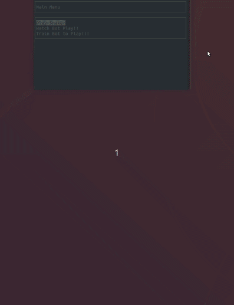

# RL Snake Game

A Reinforcement Learning Snake Game written in modern C++23. An NCurses terminal menu lets you:

1. Play snake yourself.
2. Watch a trained RL bot play.
3. Train a new RL bot, then watch it play.

### Example

<p align="center">

</p>

The original snake game code was inspired by [CppND-Capstone-Snake-Game](https://github.com/udacity/CppND-Capstone-Snake-Game).

---

## Dependencies

| Dependency | Version | Notes |
|---|---|---|
| CMake | >= 3.28 | [Installation instructions](https://cmake.org/install/) |
| make | >= 4.1 | Linux/Mac |
| SDL2 | >= 2.0 | [Installation instructions](https://wiki.libsdl.org/Installation) |
| NCurses | >= 6.1 | |
| gcc/g++ or clang++ | C++23 support required | |
| GoogleTest | v1.15.2 | Fetched automatically via CMake `FetchContent` (tests only) |

### Installing dependencies on Linux

```bash
sudo add-apt-repository ppa:ubuntu-toolchain-r/test
sudo apt update
sudo apt install libsdl2-dev libncurses5-dev libncursesw5-dev
sudo apt install -y gcc-13 g++-13
export CC=gcc-13
export CXX=g++-13
```

### Installing dependencies on macOS

```bash
brew install cmake sdl2 ncurses llvm
```

---

## Building

```bash
# 1. Clone the repo
git clone <repo-url> && cd RL-Snake-Game

# 2. Configure and build
cmake -S . -B build
cmake --build build

# 3. Run
./bin/RLSnakeGame
```

### Building with tests

GoogleTest is fetched automatically by CMake — no manual installation needed.

```bash
mkdir build && cd build
cmake .. -DBUILD_TESTS=ON && cmake --build .
ctest --output-on-failure
```

---

## Training

Training runs for 1,000 episodes by default using Q-Learning with ε-greedy exploration:

| Parameter | Default |
|---|---|
| Episodes | 1,000 |
| Max steps per episode | 1,000,000 |
| Epsilon (ε-greedy) | 0.5 |
| Discount factor (γ) | 0.9 |
| Step size (α) | 0.5 |

Trained Q-value tables are saved to disk and loaded automatically when you select "Watch bot play."

---

## Code Structure

Headers are in `include/`, source files in `src/`, and tests in `tests/`.

### Reinforcement Learning API

Template-based tabular RL API. Q-Learning is fully implemented; the interface also supports SARSA and Expected SARSA.

| File | Description |
|---|---|
| `include/state_action_map.h` | Maps (state, action) pairs to Q-values |
| `include/action_valuer.h` | Interface for Q-value lookup and update |
| `include/policy.h` | Policy interface (ε-greedy implemented) |
| `include/agent.h` | `Agent` interface and `AgentImpl` |
| `include/learner.h` | `Learner` interface and `QLearner` |
| `include/environment.h` | Environment interface |
| `include/simulator.h` | Runs agent–environment interaction loops |

### Snake Game

| File | Description |
|---|---|
| `include/snake.h` / `src/snake.cpp` | Snake entity |
| `include/food.h` / `src/food.cpp` | Food placement |
| `include/game.h` / `src/game.cpp` | Core game logic |
| `include/game_environment.h` / `src/game_environment.cpp` | Wraps the game as an RL `Environment` |
| `include/game_simulator.h` / `src/game_simulator.cpp` | Runs RL simulation over the game |
| `include/controller.h` | Controller interface |
| `include/keyboard_controller.h` / `src/keyboard_controller.cpp` | Human keyboard input |
| `include/agent_controller.h` / `src/agent_controller.cpp` | Bot controller driven by the RL agent |
| `include/renderer.h` / `src/renderer.cpp` | SDL2 rendering |

### NCurses UI

| File | Description |
|---|---|
| `include/menu.h` / `src/menu.cpp` | Generic menu component |
| `include/game_menu_factory.h` / `src/game_menu_factory.cpp` | Builds the main game menu |
| `include/gui.h` / `src/gui.cpp` | Top-level NCurses GUI |

### IO

| File | Description |
|---|---|
| `include/io.h` / `src/io.cpp` | Save and load trained Q-value tables |

### Entry Point

| File | Description |
|---|---|
| `include/trainer.h` / `src/trainer.cpp` | Orchestrates training runs |
| `include/main_utils.h` / `src/main_utils.cpp` | Startup helpers |
| `src/main.cpp` | `main()` — launches the NCurses GUI |

### Factories

`include/agent_factory.h` and `include/action_valuer_factory.h` assemble RL components, and adapter classes wire the snake game to the RL algorithms and GUI.

